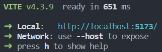

# 说明

## 项目环境配置

- 项目使用Vue-CLI搭建，想要运行，请先安装 node.js + Vue CLI
- Vue CLI官网：[Home | Vue CLI (vuejs.org)](https://cli.vuejs.org/zh/)

### 项目依赖安装

- 如果就是直接打开我发的整个压缩包，这步可忽略

```
npm install
```

### 运行

```
npm run serve
```

- 成功后直接在浏览器进入local url即可




## 代码

- 完成画SVG图的 d3 代码装在 MapComponent.vue 中，由RoadMap.vue调用，其他的跟Vue相关，可以不管

```
│  App.vue
│  main.js
│  router.js
│
├─assets
│      logo.png
│
├─components
│  ├─roadData
│  │      *MapComponent.vue
│  │
│  └─ui
│          BaseButton.vue
│          BaseCard.vue
│
└─pages
        *RoadMap.vue
        WelcomePage.vue
```


## 效果：

- 初版

  - 可缩放，拖动

  - 可多选显示

  - 不同类别颜色区分

  - 动图展示

    

- 2版

  - 增加鼠标hover效果

    - 显示消息框展示properties
    - 对应元素变色，好观察

  - 动图展示

    

- 3版

  - 增加对road_sec_id属性的突出显示

  - 改变’路段”的值进行选择，范围为 [0,134], 0 表示全选

    
